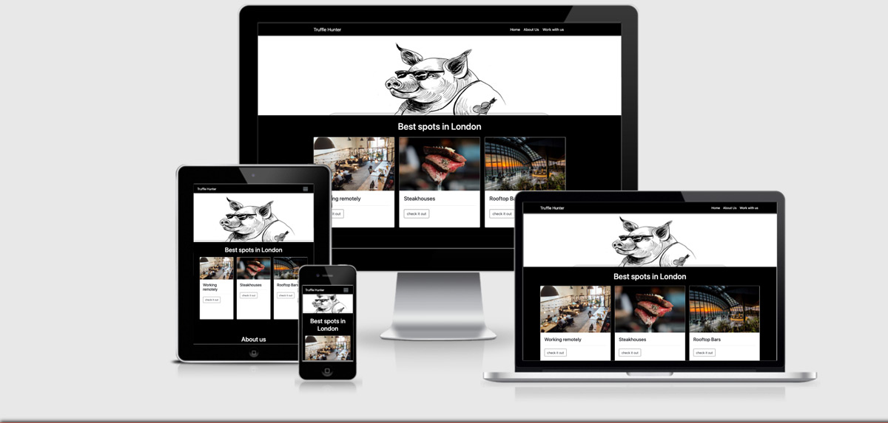

<h1 align="center">Truffle Hunter</h1>

[View the live project here.](https://babalu2017.github.io/truffle_hunter/) 

This website has the intent to help people to find the best spots in London where to work remotely or where to spend your freetime.

<h2 align="center"></h2>


## User Experience (UX)

-   ### User stories

    -   #### First Time Visitor Goals

        1. As a First Time Visitor, I want to easily understand the main purpose of the site. [view](assets/images/readme_truffle_imgs/op_purpose_website.jpg)

        2. As a First Time Visitor, I want to be able to easily navigate throughout the site to find content. [view]assets/images/readme_truffle_imgs/op_navigation.jpg)


    -   #### Returning Visitor Goals

        1. As a Returning Visitor, I want to find information about new spots. [view](assets/images/readme_truffle_imgs/op_spots_where_to.jpg)

        2. As a Returning Visitor, I want to find the best way to get in contact with the website owner. [view](assets/images/readme_truffle_imgs/op_contact_us_form.jpg)
        

    -   #### Frequent User Goals
        1. As a Frequent User, I want to be update about new spots where to spend my freetime. [view](assets/images/readme_truffle_imgs/op_spots_where_to.jpg)


        2. As a Frequent User, I want to sign up to the Newsletter so that I am emailed any major updates and/or changes to the website or organisation. [view](assets/images/readme_truffle_imgs/op_newsletter.jpg)

-   ### Design
    -   #### Colour Scheme
        -   The main colours used are black, gray and white provided by bootstrap.
    -   #### Typography
        -    I used the default bootstrap font-family Verdana, Geneva, Tahoma. The font is used throughout the whole website with Sans Serif as the fallback font in case for any reason the font isn't being imported into the site correctly. I think this font is a clean and it is used frequently in programming, so it is both attractive and appropriate.
    -   #### Imagery
        -   Imagery is important. I used imgs(free lincence) and I used photoshop to make them web-friendly(resizing them).

*   ### Wireframes

    -   Wireframe - [View](assets/images/wireframes/op_wireframes.jpg)

*   ### Site Map

    -   Site Map - [View](assets/images/readme_truffle_imgs/navigation_model/road_map.jpg)

## Features

-   Responsive on all device sizes

-   Interactive elements

### Languages Used

-   [HTML5](https://en.wikipedia.org/wiki/HTML5)
-   [CSS3](https://en.wikipedia.org/wiki/Cascading_Style_Sheets)


### Frameworks, Libraries & Programs Used

1. [Bootstrap 4.4.1:](https://getbootstrap.com/docs/4.4/getting-started/introduction/)
    - Bootstrap was used to assist with the responsiveness and styling of the website.
1. [Google Fonts:](https://fonts.google.com/)
    - Google fonts were used to import the 'Titillium Web' font into the style.css file which is used on all pages throughout the project.
1. [Font Awesome:](https://fontawesome.com/)
    - Font Awesome was used on all pages throughout the website to add icons for aesthetic and UX purposes.
1. [jQuery:](https://jquery.com/)
    - jQuery came with Bootstrap to make the navbar responsive but was also used for the smooth scroll function in JavaScript.
1. [Git](https://git-scm.com/)
    - Git was used for version control by utilizing the Gitpod terminal to commit to Git and Push to GitHub.
1. [GitHub:](https://github.com/Babalu2017/ElectricSkateboardClub)
    - GitHub is used to store the projects code after being pushed from Git.
1. [Adobe Xd:](https://www.adobe.com/uk/products/xd.html)
    - xd was used to create the wireframes during the design process.
1. [Adobe Photoshop:](https://www.adobe.com/uk/products/photoshop.html)
    - Photoshop was used to edit photos as well as to make them more web friendly (resizing_save for web legacy option).
1. [Google Maps Api:](https://developers.google.com/maps)
    - google map api was used on three pages whereto.html, whereto_steakhouse.html and rooftops.hmtl.In all pages the users can find a big map as header imgage where they can interact with and find the spot they're looking for.
1. [Emailjs:](https://www.emailjs.com/)
    - emailjs api was used to link all the forms with the website's owner. The user can sand test as well as upload file.If the inputs inside the forms are filled correctly the user will receive a message. I used a status 200 response to trigger that event. [view](assets/images/readme_truffle_imgs/emailjs/emailjs_screenshot.jpg)
## Testing

The W3C Markup Validator, W3C CSS Validator and JSHINT Validator Services were used to validate every page of the project to ensure there were no syntax errors in the project.

1.  HTML Homepage validator [view](assets/images/validator/index_html.jpg)
2.  HTML work remotly page validator [view](assets/images/validator/whereto_html.jpg)
3.  HTML Best Rooftops page validator [view](assets/images/validator/rooftops_html.jpg)
4.  HTML Best Steakhouses page validator [view](assets/images/validator/whereto_steakhouse_html.jpg)
5.  HTML Contact Us validator [view](assets/images/validator/contact_html.jpg)
6.  CSS  Style_Sheet validator [view](assets/images/validator/style_css.jpg)
7.  JS  main [view](assets/images/validator/main_js.jpg)
8.  JS  mapRooftops [view](assets/images/validator/rooftops_js.jpg)
9.  JS  mapSteak [view](assets/images/validator/steakhouses_js.jpg)
10.  JS  newsletter [view](assets/images/validator/newsletter_js.jpg)
11.  JS  sendEmail [view](assets/images/validator/sendEmail_js.jpg)
12.  JS  suggestSpot [view](assets/images/validator/suggestSpot_js.jpg)
13.  JS  workRemote [view](assets/images/validator/workRemote_js.jpg)

### Testing User Stories from User Experience (UX) Section

-   #### First Time Visitor Goals

    1. As a First Time Visitor, I want to easily understand the main purpose of the site and learn more about the organisation. [view](assets/images/readme_truffle_imgs/op_about_us.jpg)

        

    2. As a First Time Visitor, I want to be able to easily be able to navigate throughout the site to find content.

        1. The site has been designed to be fluid and never to entrap the user. At the top of each page there is a clean navigation bar, each link describes what the page they will end up at clearly. [view](assets/images/readme_truffle_imgs/op_navigation.jpg)

        2. At the bottom of each blog pages there is a redirection call to action to ensure the user always has somewhere to go and doesn't feel trapped as they get to the bottom of the page. [view](assets/images/readme_truffle_imgs/op_buttons.jpg)
        


-   #### Returning Visitor Goals

    1. As a Returning Visitor, I want to find the new spots. [view](assets/images/readme_truffle_imgs/op_spots_where_to.jpg)

    2. The navigation bar clearly highlights the "Contact Us" Page. [view](assets/images/readme_truffle_imgs/op_navigation.jpg)

    3. Here they can fill out the form on the page. [view](assets/images/readme_truffle_imgs/op_contact_us_form.jpg)
        
        

-   #### Frequent User Goals


    1. As a Returning Visitor, I want to find the new spots. [view](assets/images/readme_truffle_imgs/op_spots_where_to.jpg)

    2. The navigation bar clearly highlights the "Contact Us" Page. [view](assets/images/readme_truffle_imgs/op_navigation.jpg)

    3. Here they can fill out the form on the page. [view](assets/images/readme_truffle_imgs/op_contact_us_form.jpg)


### Further Testing

1.   The Website was tested on different browsers: 
    - [Google Chrome](assets/images/readme_truffle_imgs/op_chrome_browser.jpg) 
    - [Microsoft Edge](assets/images/readme_truffle_imgs/op_edge_browser.jpg)
    - [Safari](assets/images/readme_truffle_imgs/op_safari_browser.jpg).
2.   The website was viewed on a variety of devices such as: 
    - [Laptop](assets/images/readme_truffle_imgs/devices_view/op_laptop.jpg) 
    - [iPhoneXR](assets/images/readme_truffle_imgs/devices_view/op_iphone_xr.jpg) 
    - [iPhone12](assets/images/readme_truffle_imgs/devices_view/op_iphone_12_pro.jpg)
    - [Samsung_Galaxy_Fold](assets/images/readme_truffle_imgs/devices_view/op_galaxy_fold.jpg)
    - [iPad_Air](assets/images/readme_truffle_imgs/devices_view/op_ipad_air.jpg)
    - [iPad_Air_Mini](assets/images/readme_truffle_imgs/devices_view/op_ipad_mini.jpg)
    - [Samsung_Galaxy_a51/71](assets/images/readme_truffle_imgs/devices_view/op_samsung_galaxy_a51_a71.jpg)
    - [Samsung_Galaxy_s8+](assets/images/readme_truffle_imgs/devices_view/op_samsung_galaxy_s8+.jpg)
    - [Nest_Hub](assets/images/readme_truffle_imgs/devices_view/op_tablet_nes_hub.jpg)
    - [Nest_Hub_Max](assets/images/readme_truffle_imgs/devices_view/op_tablet_nest_hub_max.jpg)
3.   A large amount of testing was done to ensure that all pages were linking correctly [view](img/manual_testing/manual_testing.jpg).
4.   Friends and family members were asked to review the site and documentation to point out any bugs and/or user experience issues.

### Known Bugs/Errors

-   Stackoverflow: [Permissions_Policy_Header](assets/images/readme_truffle_imgs/bugs_errors/permissions_policy_interest_cohort.jpg).
-   GitHub: [Github_Permissions_Policy_Use](assets/images/readme_truffle_imgs/bugs_errors/github_permissions_policy_interest_cohort.jpg)


## Deployment

### GitHub Pages

The project was deployed to GitHub Pages using the following steps...

1. Log in to GitHub and locate the [GitHub Repository](https://github.com/Babalu2017/ElectricSkateboardClub)
2. At the top of the Repository (not top of page), locate the "Settings" Button on the menu.
    - Alternatively Click [Here](https://raw.githubusercontent.com/) for a GIF demonstrating the process starting from Step 2.
3. Scroll down the Settings page until you locate the "GitHub Pages" Section.
4. Under "Source", click the dropdown called "None" and select "Master Branch".
5. The page will automatically refresh.
6. Scroll back down through the page to locate the now published site [link](https://github.com/Babalu2017/ElectricSkateboardClub/settings/pages) in the "GitHub Pages" section.

### Forking the GitHub Repository

By forking the GitHub Repository we make a copy of the original repository on our GitHub account to view and/or make changes without affecting the original repository by using the following steps...

1. Log in to GitHub and locate the [GitHub Repository](https://github.com/Babalu2017/ElectricSkateboardClub)
2. At the top of the Repository (not top of page) just above the "Settings" Button on the menu, locate the "Fork" Button.
3. You should now have a copy of the original repository in your GitHub account.

### Making a Local Clone

1. Log in to GitHub and locate the [GitHub Repository](https://github.com/Babalu2017/ElectricSkateboardClub)
2. Under the repository name, click "Clone or download".
3. To clone the repository using HTTPS, under "Clone with HTTPS", copy the link.
4. Open Git Bash
5. Change the current working directory to the location where you want the cloned directory to be made.
6. Type `git clone`, and then paste the URL you copied in Step 3.

```
$ git clone https://github.com/YOUR-USERNAME/YOUR-REPOSITORY
```

7. Press Enter. Your local clone will be created.

```
$ git clone https://github.com/YOUR-USERNAME/YOUR-REPOSITORY
> Cloning into `CI-Clone`...
> remote: Counting objects: 10, done.
> remote: Compressing objects: 100% (8/8), done.
> remove: Total 10 (delta 1), reused 10 (delta 1)
> Unpacking objects: 100% (10/10), done.
```

Click [Here](https://help.github.com/en/github/creating-cloning-and-archiving-repositories/cloning-a-repository#cloning-a-repository-to-github-desktop) to retrieve pictures for some of the buttons and more detailed explanations of the above process.

## Credits

### Code

-   Custom label input field upload file. I used [Stackoverflow](https://stackoverflow.com/questions/37713126/bootstrap-show-file-name-after-select)

-   For the animation hamburger menu' I used [MDBootstrap](https://mdbootstrap.com/docs/standard/extended/hamburger-menu/)

-   [Bootstrap4](https://getbootstrap.com/docs/4.4/getting-started/introduction/): Bootstrap Library used throughout the project mainly to make site responsive using the Bootstrap Grid System.

-   the README.md file structure follow the [codeistitute](https://github.com/Code-Institute-Solutions/SampleREADME/blob/master/README.md) sample.

### Content

-   All content was written by the developer.

-   Psychological properties of colours text in the README.md was found [here](http://www.colour-affects.co.uk/psychological-properties-of-colours)

### Media

-   All Images were downloaded from [Unsplash](https://unsplash.com/s/photos/electric-skateboard).

### Acknowledgements

-   Tutor support at Code Institute for their support.